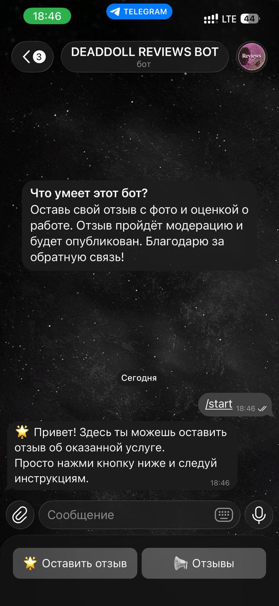
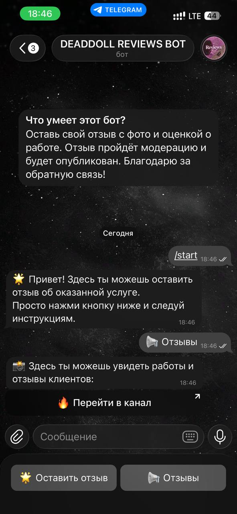
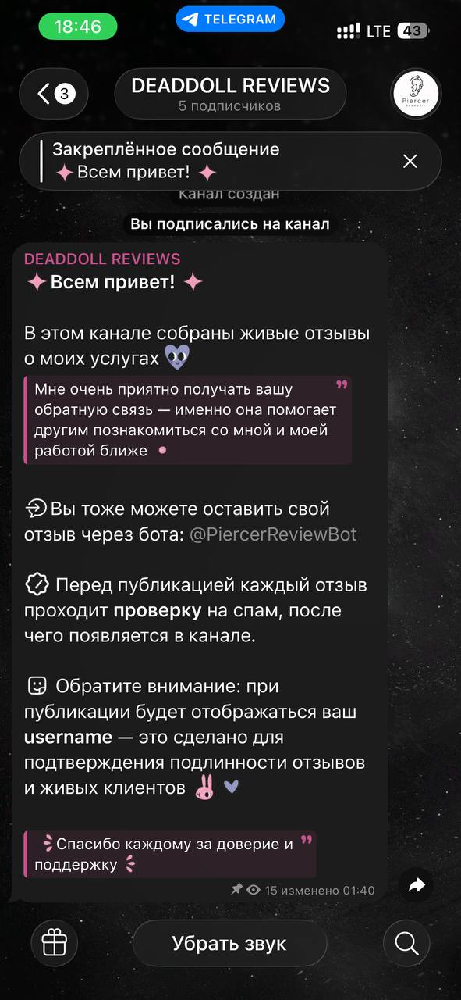
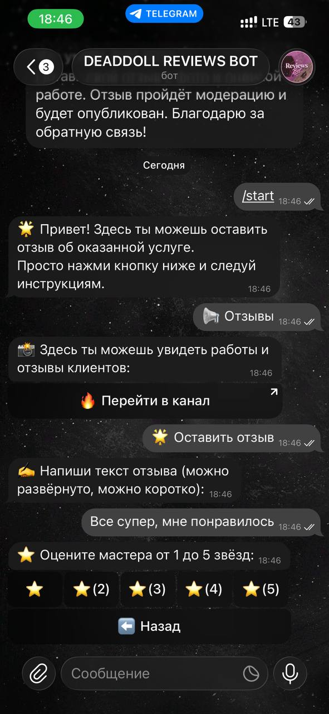
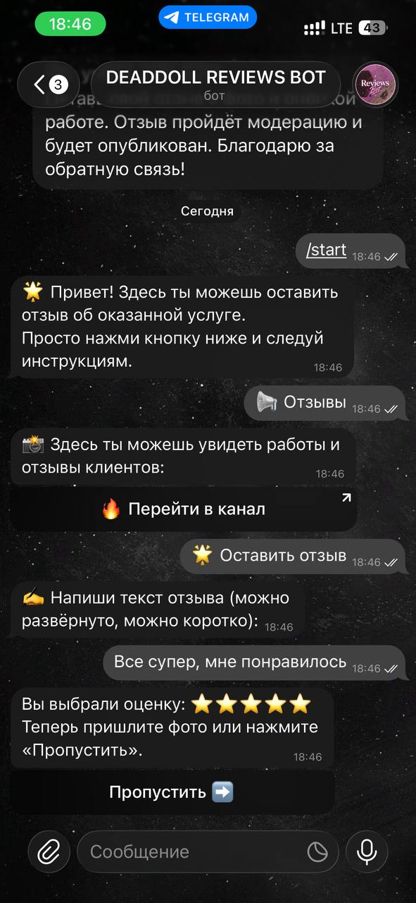
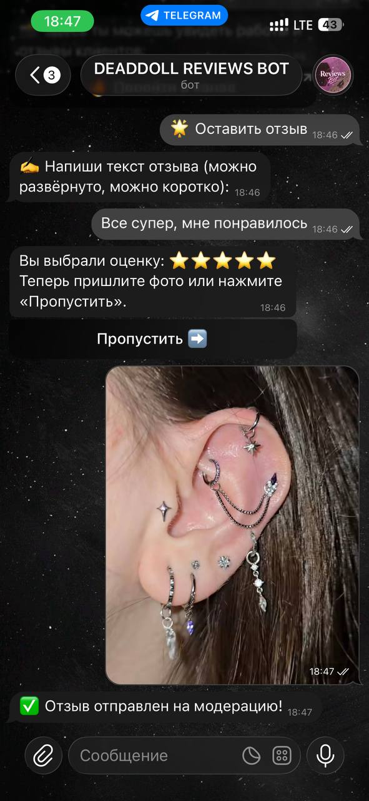
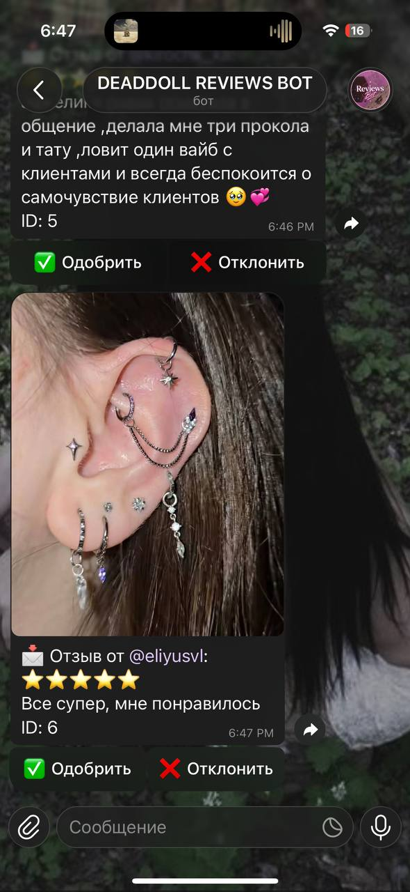

# 🤖 Telegram-бот для отзывов с модерацией и рейтингом

<div align="center">

### ⭐ Удобный сбор отзывов для мастеров, студий и небольшого бизнеса

Клиенты отправляют отзывы с оценкой и фото,  
администратор модерирует их,  
а бот автоматически публикует всё в Telegram-канал.

<br>


</div>

---

# ✨ Возможности

## 👤 Для клиентов

- Красивое главное меню с кнопками
- Пошаговое заполнение отзыва:
  - текст
  - рейтинг ⭐ от 1 до 5
  - фотография (необязательно)
- Удобная кнопка «Назад» на каждом шаге
- Возможность отменить отправку
- После отправки — ссылка на канал с отзывами

---

## 🛡️ Для администратора

- Мгновенные уведомления о новых отзывах
- Инлайн-модерация прямо в Telegram
- Кнопки:
  - ✅ Одобрить
  - ❌ Отклонить
- Автоматическая публикация одобренных отзывов в канал
- Отклонённые отзывы не публикуются

---

## 📢 Публичный канал отзывов

Бот автоматически оформляет публикации:

- ⭐ рейтинг звёздами
- 👤 имя пользователя
- 📝 текст отзыва
- 📷 фотография

Все отзывы выглядят аккуратно и профессионально.

---

# 🛠️ Стек технологий

<div align="center">

| Технология | Описание |
|---|---|
| Python 3.12 | Основной язык |
| Aiogram 3.x | Telegram Bot Framework |
| FSM | Машина состояний |
| SQLite | База данных |
| Docker | Контейнеризация |
| Amvera | Облачный деплой |
| Git | Контроль версий |

</div>

---

# ⚙️ Установка и запуск

## 1️⃣ Клонирование репозитория

```bash
git clone https://github.com/ТВОЙ_ЛОГИН/piercer-review-bot.git
cd piercer-review-bot
```

---

## 2️⃣ Установка зависимостей

```bash
pip install -r requirements.txt
```

---

## 3️⃣ Настройка `.env`

Создайте файл `.env` и заполните его:

```env
BOT_TOKEN=your_bot_token

ADMIN_CHAT_ID=your_admin_id

CHANNEL_ID=your_channel_id
```

---

## 4️⃣ Запуск бота

```bash
python main.py
```

---

# ☁️ Деплой на Amvera

Проект полностью готов к облачному запуску через **Amvera**.

Конфигурация находится в файле:

```bash
amvera.yaml
```

Для обновления проекта достаточно выполнить:

```bash
git push
```

Все переменные окружения задаются через панель управления Amvera.

---

# 📸 Скриншоты

<div align="center">

| Главное меню | Создание отзыва |
|---|---|
|  |  |

| Выбор рейтинга | Отправка фото |
|---|---|
|  |  |

| Модерация | Публикация |
|---|---|
|  |  |

| Канал отзывов |
|---|
|  |

</div>

---

# 🚀 Преимущества проекта

- Простая установка
- Готов к продакшену
- Удобная модерация
- Красивое оформление отзывов
- Работает 24/7 в облаке
- Подходит для:
  - пирсеров
  - тату-мастеров
  - барберов
  - салонов
  - косметологов
  - любых услуг с отзывами

---

# 📞 Контакты

## 👨‍💻 Разработчик

Telegram: **@eliyusvl**

Email: **overmuf24@gmail.com**

---

# 📄 Лицензия

Проект распространяется по лицензии **MIT**.

Вы можете свободно:
- использовать
- изменять
- распространять проект

При сохранении упоминания автора.

---

<div align="center">

### ⭐ Если проект понравился — поставьте звезду репозиторию

</div>